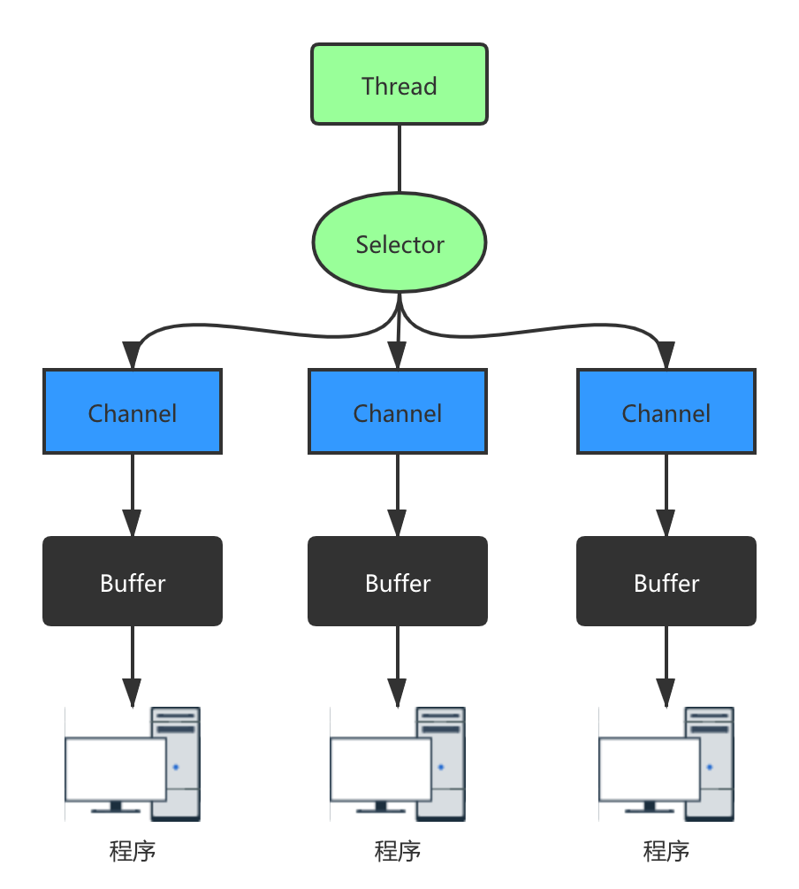
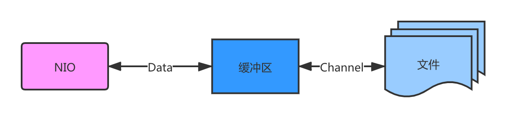

3.1Java NIO 基本介绍
1.Java NIO 全称 Java non-blocking IO ，是指 JDK 提供的新 API。从 JDK1.4 开始，Java 提供了一系列改进的输入/输出的新特性，被统称为 NIO（即 NewIO），是同步非阻塞的。
2.NIO 相关类都被放在 java.nio 包及子包下，并且对原 java.io 包中的很多类进行改写。【基本案例】
3.NIO 有三大核心部分: Channel（通道）、Buffer（缓冲区）、Selector（选择器） 。
4.NIO 是面向缓冲区，或者面向块编程的。数据读取到一个它稍后处理的缓冲区，需要时可在缓冲区中前后移动，这就增加了处理过程中的灵活性，使用它可以提供非阻塞式的高伸缩性网络。
5.Java NIO 的非阻塞模式，使一个线程从某通道发送请求或者读取数据，但是它仅能得到目前可用的数据，如果目前没有数据可用时，就什么都不会获取，而不是保持线程阻塞，所以直至数据变的可以读取之前，该线程可以继续做其他的事情。非阻塞写也是如此，一个线程请求写入一些数据到某通道，但不需要等待它完全写入，这个线程同时可以去做别的事情。【后面有案例说明】
6.通俗理解：NIO 是可以做到用一个线程来处理多个操作的。假设有 10000 个请求过来,根据实际情况，可以分配 50 或者 100 个线程来处理。不像之前的阻塞 IO 那样，非得分配 10000 个。
7.HTTP 2.0 使用了多路复用的技术，做到同一个连接并发处理多个请求，而且并发请求的数量比 HTTP 1.1 大了好几个数量级。
案例说明 NIO 的 Buffer

3.2 NIO 和 BIO 的比较
BIO 以流的方式处理数据，而 NIO 以块的方式处理数据，块 I/O 的效率比流 I/O 高很多。
BIO 是阻塞的，NIO 则是非阻塞的。
BIO 基于字节流和字符流进行操作，而 NIO 基于 Channel（通道）和 Buffer（缓冲区）进行操作，数据总是从通道读取到缓冲区中，或者从缓冲区写入到通道中。Selector（选择器）用于监听多个通道的事件（比如：连接请求，数据到达等），因此使用单个线程就可以监听多个客户端通道。

3.3 NIO 三大核心原理示意图
3.3.1 Selector、Channel 和 Buffer 关系图（简单版）

每个 Channel 都会对应一个 Buffer。
Selector 对应一个线程，一个线程对应多个 Channel（连接）。
该图反应了有三个 Channel 注册到该 Selector //程序
程序切换到哪个 Channel 是由事件决定的，Event 就是一个重要的概念。
Selector 会根据不同的事件，在各个通道上切换。
Buffer 就是一个内存块，底层是有一个数组。
数据的读取写入是通过 Buffer，这个和 BIO，BIO 中要么是输入流，或者是输出流，不能双向，但是 NIO 的 Buffer 是可以读也可以写，需要 flip 方法切换 Channel 是双向的，可以返回底层操作系统的情况，比如 Linux，底层的操作系统通道就是双向的。

3.4 缓冲区（Buffer）
3.4.1 基本介绍
缓冲区（Buffer）：缓冲区本质上是一个可以读写数据的内存块，可以理解成是一个容器对象（含数组），该对象提供了一组方法，可以更轻松地使用内存块，，缓冲区对象内置了一些机制，能够跟踪和记录缓冲区的状态变化情况。Channel 提供从文件、网络读取数据的渠道，但是读取或写入的数据都必须经由 Buffer，如图:【后面举例说明】

